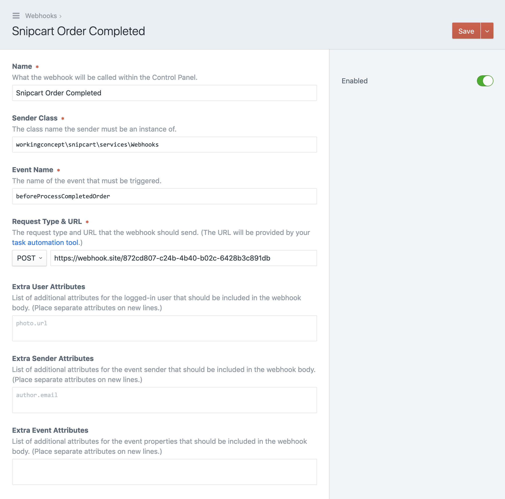

---
meta:
  - name: description
    content: A collection of things you can do with the Snipcart plugin.
---

# Recipes

There's lots you can do with the Snipcart plugin. Below are some examples you can use or take as inspiration. [Let us know](mailto:support@workingconcept.com) if you've done something cool we can add here!

## Webhooks

There's a lot you can do by responding to Snipcart's [webhooks](/webhooks/when.md)! Here are some examples.

### Send Low Stock Warning

Use the `init()` function of a custom module to listen for changes to product inventory and send an email if there are fewer than 10 items left in stock.

```php
Event::on(
    Products::class,
    Products::EVENT_PRODUCT_INVENTORY_CHANGE,
    function(InventoryEvent $event) {

        // fetch product detail info regardless of the field handle
        $productDetails = FieldHelper::getProductInfo($event->entry);
        
        // adjusted inventory = current + delta
        $newQuantity = $productDetails->inventory + $event->quantity;

        // send
        if ($newQuantity < 10) {
            $message = new Message();
            $message->setTo('mrmanager@suddenvalley.biz');
            $message->setSubject($event->entry->title . ' stock is low!');
            $message->setHtmlBody("<p>Re-stock soon! There are {$newQuantity} units left.</p>");

            Craft::$app->mailer->send($message);
        }
    }
);
```

### Send Webhooks

Install [Pixel & Tonic's Webhooks plugin](https://github.com/craftcms/webhooks) to trigger Zapier/IFTTT actions and more. Have completed orders or updated customer information flash your lights or open your garage door. Or even something more useful.



Install the Webhooks plugin and create a new webhook. To fire an outgoing webhook when an order is completed, use...

- **Sender Class** `workingconcept\snipcart\services\Webhooks`
- **Event Name** `beforeProcessCompletedOrder`

Post to whatever URL is relevant. (The [webhook.site](https://webhook.site) URL in the screenshot above is convenient for testing.)

The resulting post will come complete with all the order data.

## Frontend

### On-Page Options

Options you've defined on product buttons will display in the cart. If you'd like to expose them as selections on your product detail page, however, you can create fields and use JavaScript to link their values to the buy button's hidden details.

Let's say we're selling coffee and we'd like customers to be able to select the grind before adding the item to the cart.

#### 1. Add a select menu and [buy button](/templating/fields.md) to your template.

```twig
<div class="product-detail">
    <label>{{ "Select a Grind"|t }}</label>

    <select class="grind-select" name="data-item-custom1">
        
            <option value="{{ grind }}">
                {{ grind }}
            </option>
        
    </select>

    {{ coffee.productDetails.getBuyNowButton({
        classes: ['btn'],
        text: "Add to Cart"|t,
        customOptions: [
            {
                name: 'Grind',
                required: true,
                options: grinds
            }
        ]
    }) }}
</div>
```

The resulting markup will look something like this. Note the `data-item-custom1` name we gave to the selector.

```html
<div class="product-detail">
    <label>Select a Grind</label>

    <select class="grind-select" name="data-item-custom1">
        <option value="Whole Bean">Whole Bean</option>
        <option value="French Press">French Press</option>
        <option value="Cone Drip Filter">Cone Drip Filter</option>
        <option value="Espresso">Espresso</option>
        <option value="Turkish">Turkish</option>
    </select>

    <a href="#"
        class="snipcart-add-item btn"
        data-item-id="house-blend"
        data-item-name="House Blend"
        data-item-price="12.50"
        data-item-url="https://craftcms.dev/products/house-blend"
        data-item-quantity="1"
        data-item-taxable="false"
        data-item-shippable="true"
        data-item-width="13"
        data-item-length="20"
        data-item-height="10"
        data-item-weight="390"
        data-item-custom1-name="Grind" 
        data-item-custom1-required="true" 
        data-item-custom1-options="Whole Bean[+0]|French Press[+0]|Cone Drip Filter[+0]|Espresso[+0]|Turkish[+0]"
    >Add to Cart</a>
</div>
```

#### 2. Bind input changes to buy button properties.

A quick little bit of jQuery can listen for the select menu to change, look in `product-detail` for a matching `data-item-custom*` property, and update it with the new selection.

:::tip
This example will work with `data-item-custom*` properties as well as standard ones like `data-item-quantity`.
:::

```js
// find matching attribute and set its value
$('.option select').unbind('change').change(function(e){
    var $addButton = $(this).closest('.product-detail').find('.snipcart-add-item');
    var changedAttribute = $(this).attr('name');

    if (changedAttribute.indexOf('data-item-custom') !== -1) {
        // set custom field value
        $addButton.attr(changedAttribute + '-value', $(this).val());
    } else {
        // change attribute directly (data-item-quantity)
        $addButton.attr(changedAttribute, $(this).val());
    }
});
```

Now when the customer chooses _Add to Cart_, the product will appear in the cart with the previously-selected grind.

## Miscellaneous

### Save Product Details with PHP

```php
// ... get an Entry element ($entry)

$entry->setFieldValue(
    'myProductDetails',
    [
        'sku' => 'fancy-hat',
        'price' => 120,
        'weight' => 500,
        'weightUnit' => 'grams',
        'shippable' => true,
        'taxable' => true,
        'length' => 8,
        'width' => 8,
        'height' => 12,
        'dimensionsUnit' => 'inches',
    ]
);

Craft::$app->getElements()->saveElement($entry);
```

### Query Product Details with [CraftQL](https://github.com/markhuot/craftql)

If you have a section with a `products` handle and a Product Details field whose handle is `productDetails`...

```graphql
query {
  entries(section:[products]) {
    ... on Products {
      productDetails {
        price
        sku
        shippable
        taxable
        weight
        weightUnit
        length
        width
        height
        dimensionsUnit
        inventory
      }
    }
  }
}
```

Result:

```json
{
  "data": {
    "entries": [
      {
        "productDetails": {
          "price": 8.99,
          "sku": "win-fries-influence-purple",
          "shippable": true,
          "taxable": true,
          "weight": 454,
          "weightUnit": "grams",
          "length": 7,
          "width": 5,
          "height": 1,
          "dimensionsUnit": "centimeters",
          "inventory": 92
        }
      },
      ...
    ]
  }
}