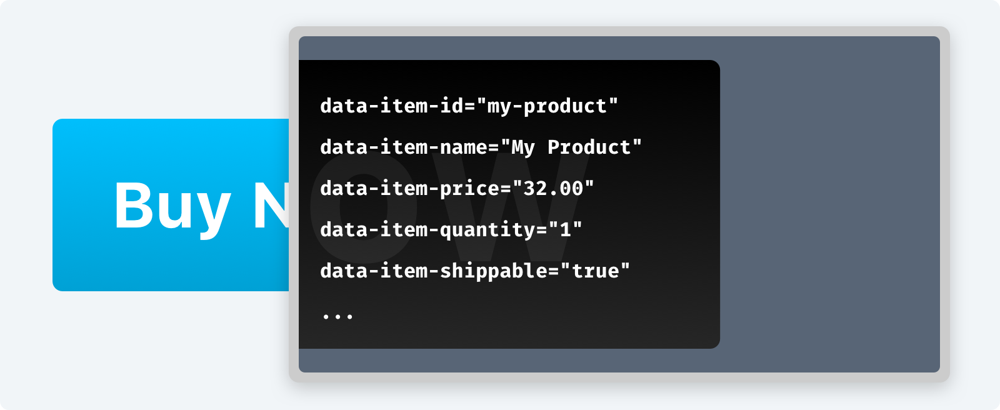

---
meta:
  - name: description
    content: How to integrate Snipcart with your Craft CMS frontend.
---

# Add Snipcart to Your Site



If there's one thing you need to know, it's that **Snipcart's definition of store products comes from information embedded in buy buttons.**

This means you can build up your Craft site and Elements however you'd like. Just make sure your buy buttons send exactly the details you want into the cart.

Start with [Snipcart's installation guide](https://docs.snipcart.com/v2/) if you'd prefer to write your own markup, or use the following template tags to have it generated for you.

## Cart Snippet

Add Snipcart's JavaScript snippet, using `cartSnippet(false)` if you've already included jQuery:

```twig
{# include Snipcart JS #}
{{ craft.snipcart.cartSnippet }}
```

## Cart Button

Add a link that'll include the item count and pop open the cart modal when clicked:

```twig
{# View Cart #}
{{ craft.snipcart.cartLink }}
```

## Buy Button

Buy buttons use data attributes to define Snipcart products. The included _Product Details_ field type provides a highly configurable way of establishing these buttons.

The simplest version looks like this, and you'd add it to product detail pages or wherever you'd like to let a visitor add a product to the cart:

```twig
{# Buy Now #}
{{ entry.productDetails.getBuyNowButton() | raw }}
```

More on customizing these buttons [here](/templating/fields.md).